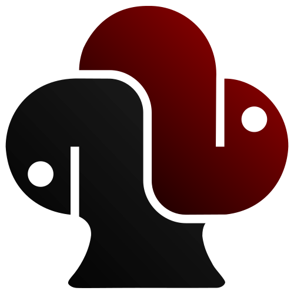

<div align="center">



</div>

# clubs_gym

[](https://badge.fury.io/py/clubs_gym)
[](https://pepy.tech/project/clubs_gym)
[](https://codecov.io/gh/fschlatt/clubs_gym)
[](https://www.codefactor.io/repository/github/fschlatt/clubs_gym)

clubs_gym is a [gym](https://gym.openai.com/) wrapper around the [clubs](https://github.com/fschlatt/clubs) python poker library. [clubs](https://github.com/fschlatt/clubs) is used for running arbitrary configurations of community card poker games. This includes anything from simple Leduc or [Kuhn](https://en.wikipedia.org/wiki/Kuhn_poker) poker to full n-player [No Limit Texas Hold'em](https://en.wikipedia.org/wiki/Texas_hold_%27em) or [Pot Limit Omaha](https://en.wikipedia.org/wiki/Omaha_hold_%27em#Pot-limit_Omaha).
## Install

Install using `pip install clubs-gym`.

# How to use

By running `import clubs_gym`, several pre-defined poker clubs poker configurations are registered with gym (call `clubs_gym.ENVS` for a full list). Custom environments can be registered with `clubs_gym.envs.register({"{environment_name}": {config_dictionary})}`. Environment names must follow the gym environment name convention ({title-case}-v{version_number}). Check the [clubs documentation](https://clubs.readthedocs.io/en/latest/index.html) for additional information about the structure of a configuration dictionary.

Since [gym](https://gym.openai.com/) isn't designed for multi-agent games, the api is extended to enable registering agents. This is not required, but ensures each agent only receives the information it's supposed to. An agent needs to inherit from the `clubs_gym.agent.base.BaseAgent` class and implement the `act` method. `act` receives a game state dictionary and needs to output an integer bet size. A list of agents the length of the number of players can then be registered with the environment using `env.register_agents`. By calling `env.act({observation_dictionary})`, the observation dictionary is passed to the correct agent and the agent's bet is returned. This can then be passed on the `env.step` function. An example with an optimal Kuhn agent (`clubs_gym.agent.kuhn.NashKuhnAgent`) is given below.

## Example

```python
import gym

import clubs_gym

env = gym.make("KuhnTwoPlayer-v0")
env.register_agents([clubs_gym.agent.kuhn.NashKuhnAgent(0.3)] * 2)
obs = env.reset()

while True:
    bet = env.act(obs)
    obs, rewards, done, info = env.step(bet)

    if all(done):
        break

print(rewards)
```
